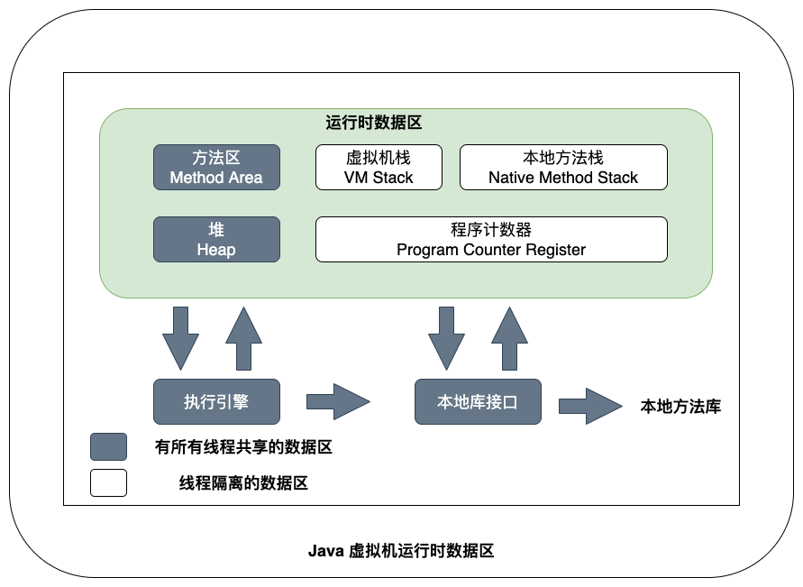
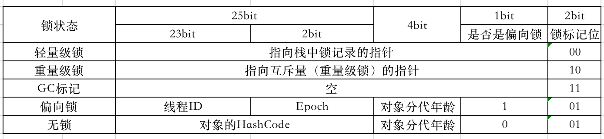
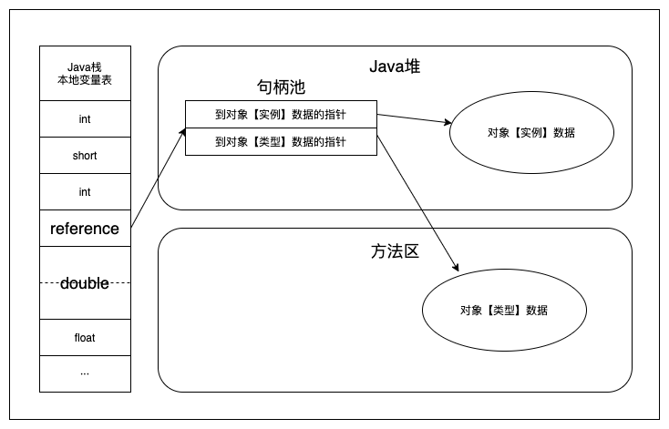
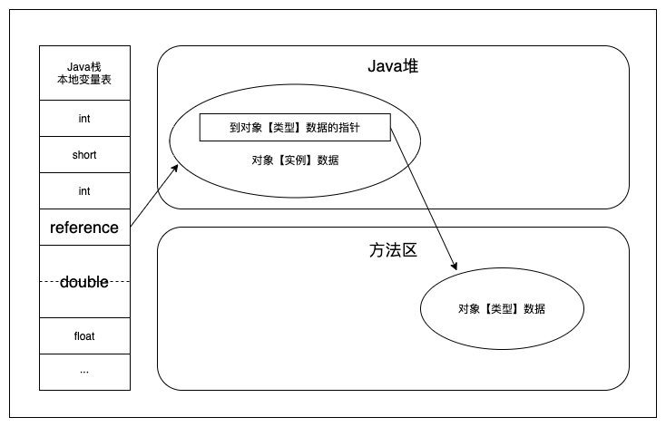
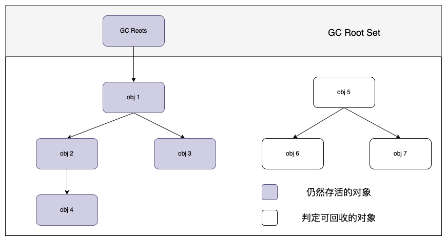

# 1、Java内存区域与内存溢出异常
## 1.1 概述
> Java程序猿把内存控制权交给了Java虚拟机，在Java虚拟机自动内存管理机制下，不再需要为每个new出来的对象去写配对的delete/free代码去释放内存，不容易出现内存泄露和内存溢出问题；但是出现内存泄露、内存溢出问题的时候，就非常难排查，所以我们需要了解虚拟机是怎么使用内存的，才能快速排出并解决内存问题。

## 1.2 运行时数据区域



### 1.2.1 程序计数器（Program Counter Register） -- 线程私有内存；行号指示器
> 1. 程序计数器是一块比较小的内存空间，可以看作是当前线程的执行的字节码的行号指示器。  
> 2. 由于Java虚拟机的多线程是通过此案城轮流切换并分配处理器（CPU）执行时间的方式来实现的，为了能让线程在切换之后恢复到正确的执行位置，所以每个线程都需要有一个独立的程序计数器，线程之间的计数器互不影响，独立存储。

### 1.2.2 Java虚拟机栈（Java Virtual Machine Stacks） -- 线程私有内存；局部变量表
> 1. 生命周期与线程相同
> 2. 虚拟机栈描述的是Java方法执行的内存模型：每个方法在执行的同时都会创建一个栈帧（Stack Frame）用于存储局部变量表、操作数栈、动态链接、方法出口信息等。
> 3. 我们平常说的“栈”其实说是虚拟机栈中【局部表量表】部分：局部变量表存放编译器可知的各种数据类型（boolean、byte、char、short、int、float、long、double）、对象引用（reference类型，可能是指向起始地址的指针，也可能是指向一个代表对象的句柄货其他与此对象相关的位置）和returnAddress类型（指向一条字节码指令的地址）
> 4. 其中64位长度的 long 和 double 类型的数据会占用 2 个局部变量空间（Slot），其余的数据类型只占用1个Slot。
> 5. 局部变量表所需要的内存空间在【编译期间】完成分配，所以当进入一个方法的时候，这个方法需要在栈帧中分配多大的局部变量空间是完全确定的，在【方法运行期间】不会改变局部变量表的大小。
> 6. 栈中两大异常情况：  
（1）线程请求的栈深度大于虚拟机所允许的深度，抛出【StackOverflowError】异常；  
（2）如果虚拟机栈可以动态扩展，扩展的时候无法申请到足够的内存，会抛出【OutOfMemoryError】异常。


### 1.2.3 本地方法栈（Native Method Stack）
> 类似Java虚拟机栈，Java虚拟机栈执行Java方法（也就是字节码）服务，而本地方法栈则是使用到Navite方法服务（系统的C方法）；它也会抛出【StackOverflowError】、【OutOfMemoryError】异常

### 1.2.4 Java堆（Java Heap）-- 所有线程共享；GC堆
> 1. Java虚拟机所管理的内存中最大的一块。
> 2. Java堆是【所有线程共享】的一块内存区域，在虚拟机启动时创建。
> 3. Java虚拟机规范中的描述：【所有的对象实例及数组】都要在Java堆上分配内存，但是随着JIT编译器的发展和逃逸分析技术的逐渐成熟，栈上分配、标量替换优化技术将会导致一些微妙的变化发生，所有的对象实例都分配在堆上变得不是那么“绝对”。
> 4. Java堆是垃圾收集器管理主要区域，也叫GC堆（Garbage Collected Heap）；Java堆中可以细分为 新生代和老年代；再细致一点得有 Eden空间、From Survivor空间、To Survivor空间等；
> 5. 线程私有缓冲区TLAB：JVM在内存新生代Eden Space中开辟了一小块线程私有的区域，称作TLAB（Thread-local allocation buffer）。默认设定为占用Eden Space的1%。在Java程序中很多对象都是小对象且用过即丢，它们不存在线程共享适合被快速GC，所以对于小对象通常JVM会优先分配在TLAB上，并且TLAB上的分配的是线程私有内存空间没有锁开销，所以在实践中分配多个小对象的效率通常比分配一个大对象的效率要高。
也就是说，Java中每个线程都会有自己的缓冲区称作TLAB（Thread-local allocation buffer），每个TLAB都只有一个线程可以操作，TLAB结合bump-the-pointer技术可以实现快速的对象分配，而不需要任何的锁进行同步，也就是说，在对象分配的时候不用锁住整个堆，而只需要在线程私有的缓冲区分配即可。
> 6. Java堆可以处于物理上不连续的内存空间；如果对账没有内存完成实例分配，并且对也无法在扩展（-Xmx和-Xms）时，将会抛出 OutOfMemoryError异常。

### 1.2.5 方法区（Mehtod Area）-- 永久代（HotSpot）；【类信息】、【常量】、【静态变量】、【即时编译器编译后的代码】

> 1. 方法区是各个【线程共享】的内存区域；虽然java虚拟机规范将方法区描述为Java堆中的逻辑部分，但是它却有另一个别名叫做【Non-Heap】(非堆)，目的应该就是与Java堆区分开。
> 2. 用于存储虚拟机加载的【类信息】、【常量】、【静态变量】、【即时编译器编译后的代码】等数据。
> 3. 【永久代】：对于习惯在HotSpot虚拟机上开发的老铁来说，很多人都把方法区成为【永久代】（Permanent Generation），本质上两者并不等价。仅仅是因为HotSpot虚拟机的设计团队选择把GC分代手机扩展至方法区，或者说使用永久代来实现方法区而已。其他的虚拟机（JRockit、 IBM J9）并不存在永久代这个概念。  
原则上如何实现方法区属于虚拟机实现细节，不受虚拟机规范约束，但是**现在使用永久代来实现方法区看来并不是一个好主意，因为更容易遇到内存溢出问题**（永久代有-XX：MaxPermSize的上限），因此也有放弃永久代并逐步改为采用Navite Memory来实现方法区的规划，【在Jdk1.7的HotSpot中已经把原本放在永久代的字符串常量池移出】。
> 4. 该区域的内存回收目标主要针对【常量池的回收】和【对类型的卸载】；一般来说这个区域的回收“成绩”难以令人满意，尤其是类型的卸载，条件相当苛刻，但是这部分区域的垃圾回收确实很必要。
> 5. 方法区无法满足内存分配需求时，将会抛出OutOfMemoryError异常。

### 1.2.6 运行时常量池（Runtime Constant Pool）-- 不是字符串常量池！！！
> 1. 运时时常量池是方法区的一部分；同样也会在无法满足内存分配需求时抛出OutOfMemoryError异常。
> 2. Class文件中除了有类的版本、字段、方法、接口等描述信息外，还有一项信息是常量池（Constant pool Table）,用于存放编译期生成的各种字面量和符号引用，这部分内容将在类加载后进入方法区的运行时常量池中存放。
> 3. 运行时常量池相对于Class文件常量池来说另外一个重要特征是具备动态性，Java语言并不要求常量一定只有编译期才能产生，运行时也可以将新的常量放入池中，这种特性被开发人员利用得比较多的便是String类的intern()方法。

### 1.2.7 直接内存（Direct Memory）
> 1. 并不是虚拟机运行时数据区的一部分；也不是Java虚拟机规范中定义的内存区域；
> 2. 在JDK1.4加入了NIO类后，引入了一种基于通道（Channel）与缓冲区（Buffer）的I/O方式，它可以使用Navite函数库直接分配堆外内存，然后通过一个存储在Java堆中的DirectByteBuffer对象作为这块内存的引用进行操作（避免了再Java堆和Native堆中来回复制数据）；但是当堆外内存被分配完不能满足分配需求时，会导致Java堆动态扩展时出现OutOfMemoryError异常。

## 1.3 HotSpot虚拟机对象探秘
> 深入探讨HotSpot虚拟机在Java堆中对象分配、布局和访问的全过程。

### 1.3.1 对象的创建
> 注：仅讨论普通Java对象，不包含数据组和Class对象等  
> 1. 虚拟机遇到一条new指令 -> 检查指令的参数是否在常量池（方法区）中定位到一个类的符号引用，检查这个符号引用代表的类是否已被加载、解析和初始化过 -> 类加载通过后 -> 虚拟机为新生对象分配内存（对象所需内存的大小在类加载后便可完全确认）（从java堆中划分一块确定大小的内存）   
>     1.  假设Java堆中的内存绝对规整，使用过和空闲的内存各放一边，中间放着一个指针作为分界点的指示器，那分配内存就仅仅需要把那个指针往空闲那边挪动一段与对象大小相等的距离，这种分配方法成为【指针碰撞】（Bump The Pointer）。
>     2. 假设Java堆中的内存并不规整，已使用的内存和空闲的内存互相交错，那虚拟机就需要维护一个列表记录那些内存块是可用的，在分配的时候就从列表中刚找到一块足够大的内存分配给对象实例，这种分配方式称为【空闲列表】（Free List）。  
>     3. Java对是否规整由所采用的的垃圾收集器是否带有压缩整理功能决定。（Serial、ParNew带Compact；CMS基于Mark-Sweep）
> 2. 并发情况下，分配内存不是线程安全的（就算仅仅是修改一下指针指向的位置）；  
>     1. 对分配内存空间进行同步处理 -- 采用CAS配上失败重试的方式保证更新操作的原子性；
>     2. 本地线程分配缓冲【TLAB】(Tread Local Allocaiton Buffer)：内存分配的动作按照线程划分在不同的空间中进行，每个线程在Java堆中预先分配一块内存，这块内存叫【本地线程分配缓冲】；只有TLAB用完并分配新的TLAB的时候，才需要同步锁定。可通过 -XX：+/-UseTLAB 开启。
> 3. 内存分配完成后，虚拟机需要将分配到内存的内存空间都初始化为零值（不包含对象头），如果使用了TLAB，这个工作可以【提前】在TLAB分配时进行。 -- 先设置零值再分配的TLAB
> 4. 虚拟机对对象进行必要的设置：将类的元数据信息、对象的哈希码、对象的GC分代年龄等信息存放到对象的对象头（Object Header）；
虚拟机会根据是否启用偏向锁等不同的运行状态，对对象头会有不同的设置方式。
> 5. 从虚拟机的视角来说：完成以上操作后，一个新的对象已经产生，但是从Java程序的视角来说，对象的创建才刚开始---- \<init\>方法都还没执行，所有字段都还是零。init完之后一个真正可用的对象才算完全产生出来。

### 1.3.2 对象的内存布局
> 1. 在HotSpot虚拟机中，对象在内存存储的布局可以分为3块区域：对象头（Object Header）、实例数据（Instance Data）和对齐补充（Padding）
> 2. HotSpot虚拟机的对象头分为两部分：  
>    1. 第一部分用于存储对象自身的运行时数据：哈希码（HashCode）、GC分代年龄、锁状态标志、线程持有的锁、偏向锁ID、偏向时间戳等等，这部分数据的长度在32位和63位的虚拟机（未开启压缩指针）中分别为32bit、64bit，俗称”Mark Word“。32bit空间中的 25bit用于存放对象的哈希码，4bit存储对象的分代年龄，2bit用于存储锁标记位，1bit固定位0。**Epoch**是⼀个时间戳，⽤来判断线程ID是否过时。 
>        
>    2. 第二部分存储的是类型指针，即对象指向它的类元数据指针。虚拟机通过这个指针确定这个对象是哪个类的实例。但是如果对象是一个数组的话，对象头还必须有一块用于记录数组长度的数据，因为虚拟机可以通过普通的Java对象的元数据确定Java对象的大小，但是从数组的元数据中却无法确认数组的大小。
> 3. 实例数据部分：是对象真正存储的有效信息，也是程序代码中所定义的各种类型的字段内容。父类、子类的都需要记录。这部分的存储顺序受虚拟机分配策略参数（FieldsAllocationStyle）和字段在Java源码中定义顺序的影响。HotSpot虚拟机默认分配的策略为 longs/doubles、ints、shorts/charts、bytes/booleans、oops(Ordinary Object Pointers)，从分配策略中可以看出相同宽度的字段总是被分配在一起。
> 4. 对齐补充：这部分不是必然存在，仅仅是起着占位符的作用。由于HotSpot VM的自动内存管理系统要求对象起始地址必须是8字节的整数倍。

### 1.3.3 对象的方位定位

> 1. Java程序需要通过Java栈上的reference数据来操作堆上的具体对象。虚拟机规范中只规定reference类型是一个指向对象的引用，并没有定义这个引用应该通过何种方式定位、访问堆中的对象的具体位置，所以对象访问方式是由虚拟机做具体实现的。
> 2. 主流的访问方式有【使用句柄】和【直接指针】两种：
>    1. 句柄访问：在Java堆中划分出一块内存作为句柄池子，reference中存储的就是对象的句柄地址，句柄中包含了对象实例数据和类型数据各自的具体地址信息。  
>    2. 直接指针访问：reference中存储的直接就是对象地址。
>    3. 两种对象访问方式各有优势，使用句柄来访问的最大好处就是reference中存储的是稳定的句柄地址，在对象被移动（垃圾收集移动对象是非常普遍的行为）时只会改变句柄中的实例数据指针，而reference本身不需要改变。
>    4. 使用直接指针访问的方式最大的好处就是速度更快，节省了一次指针定位的时间开销。HotSpot虚拟机是使用【直接指针】进行对象访问的。


## 1.4 实战 OutOfMemoryError异常

### 1.4.1 Java堆溢出

> 1. 限制Java堆大小为20M：  在IDEA 的VM Options添加参数
>
>    ```
>    -verbose:gc
>    -Xms20M
>    -Xmx20m
>    -Xmn10M
>    -XX:+PrintGCDetails
>    -XX:SurvivorRatio=8
>    -XX:+HeapDumpOnOutOfMemoryError
>    -XX:HeapDumpPath=/Users/chenkanglin/IdeaProjects/code/heapdump.hprof
>    ```
>
>    ```java
>    package com.code;
>    
>    import java.util.ArrayList;
>    import java.util.List;
>    
>    public class HeapOOM {
>    
>        static class OOMObject{
>    
>        }
>    
>        public static void main(String[] args) {
>            List<OOMObject> list = new ArrayList<OOMObject>();
>            while (true){
>                list.add(new OOMObject());
>            }
>        }
>    }
>    ```
>
>    ```linux
>    linux hprof目录下$ jhat java_pid64940.hprof 
>    Reading from java_pid64940.hprof...
>    Dump file created Fri Jun 17 01:07:45 CST 2022
>    Snapshot read, resolving...
>    Resolving 817396 objects...
>    Chasing references, expect 163 dots...................................................................................................................................................................
>    Eliminating duplicate references...................................................................................................................................................................
>    Snapshot resolved.
>    Started HTTP server on port 7000
>    Server is ready.
>    然后通过127.0.0.1:7000查看
>    ```
>
> 2. 通过分析工具分析出出现问题是【内存泄露】Memory Leak 还是【内存溢出】Memory Overflow。
>
>    1. 如果是内存泄露：进一步通过工具查看泄露对象到GC root的引用链。找出泄露对象怎么关联到GC Root的，就能准确定位出泄露代码的位置。
>    2. 内存溢出：内存中的对象必须存活，就需要看是否需要调大内存，检查对象的生命周期是否过长、持有时间是否过长，尝试减少程序运行期间的内存消耗。

### 1.4.2 Java虚拟机栈和本地方法栈溢出

> 1. HotSpot虚拟机中不区分虚拟机栈和本地方法栈，通过-Xoss参数设置本地方法栈大小存在实际上无效的；栈上容量可通过-Xss参数配置。
> 2. 关于Java虚拟机栈和本地方法栈在虚拟机规范中描述的两种异常，实际中两种异常都是抛出StackOverFlowError：
>    1. 线程请求的栈深度大于Java虚拟机栈所允许的最大深度，抛出StackOverFlowError异常
>    2. Java虚拟机栈拓展无法申请到足够的内存空间，抛出OutOfMemoryError异常
>    
>    ```java
>    package com.Ljava.jvm.code;
>          
>    /**
>     * VM Options: -Xss160k
>     *
>     * 虚拟机栈、本地方法栈OOM测试
>     * @author ckl
>     * @version 1.0
>     * @date 2022/6/18 12:05
>     */
>    public class JavaVMStackSOF {
>          
>        private int stackLength = 1;
>          
>        public void stackLeak(){
>            stackLength++;
>            stackLeak();
>        }
>          
>        public static void main(String[] args) throws Throwable {
>            JavaVMStackSOF oom = new JavaVMStackSOF();
>            try {
>                oom.stackLeak();
>            }catch (Throwable e){
>                System.out.println("stack length:" + oom.stackLength);
>                throw e;
>            }
>        }
>    }
>          
>    ```
>    
>    ```shell
>    stack length:774
>    Exception in thread "main" java.lang.StackOverflowError
>    	at com.Ljava.jvm.code.JavaVMStackSOF.stackLeak(JavaVMStackSOF.java:16)
>    	at com.Ljava.jvm.code.JavaVMStackSOF.stackLeak(JavaVMStackSOF.java:17)
>    	at com.Ljava.jvm.code.JavaVMStackSOF.stackLeak(JavaVMStackSOF.java:17)
>    	at com.Ljava.jvm.code.JavaVMStackSOF.stackLeak(JavaVMStackSOF.java:17)
>    	at com.Ljava.jvm.code.JavaVMStackSOF.stackLeak(JavaVMStackSOF.java:17)
>    	at com.Ljava.jvm.code.JavaVMStackSOF.stackLeak(JavaVMStackSOF.java:17)
>    	at com.Ljava.jvm.code.JavaVMStackSOF.stackLeak(JavaVMStackSOF.java:17)
>    ```
> 3. 操作系统分配给每个进程的内存是有限制的，例如32位Window限制为2GB；虚拟机提供了参数来控制Java堆（-Xmx）和方法区（-MaxPermSize最大方法区容量）这两部分内存的最大值，程序计数器消耗内存很小可以忽略；如果虚拟机进程本身耗费的内存不计算在内，呢么剩下的内存就由虚拟机栈和本地方法栈“瓜分”；每个线程分配的栈容量越大，可以创建的线程数就越少。
>
>    ```
>    为什么 32 位程序只能使用最大 2GB 内存？
>    32 位寻址空间只有 4GB 大小，于是 32 位应用程序进程最大只能用到 4GB 的内存。然而，除了应用程序本身要用内存，操作系统内核也需要使用。应用程序使用的内存空间分为用户空间和内核空间，每个 32 位程序的用户空间可独享前 2GB 空间（指针值为正数），而内核空间为所有进程共享 2GB 空间（指针值为负数）。所以，32 位应用程序实际能够访问的内存地址空间最多只有 2GB。
>    64位操作系统？
>    因此x86_64 平台上的Linux 理论上最多支持64TB的物理内存，单个进程理论上可用128TB的地址空间(高128TB被操作系统占用了)，但受限于物理内存的限制，其中最多有64TB是物理内存，其余的理论上还可以用虚拟内存(swap分区)顶包。
>    ```

### 1.4.3 方法区和运行时常量池溢出

> 1. 运行时常量池是方法区的一部分；JDK1.7后逐渐“去永久代”；**方法区用于存放Class的相关信息，如类名、访问修饰符、常量池、字段描述、方法描述等。**
>
> 2. String.intern()：如果字符串常量池中已经包含一个等于此String对象的字符串，则返回池中这个字符串的String对象；否则将此String对象包含的字符串添加到常量池中，并且返回此String对象的引用。
>
> 3. 通过-XX:PermSize 和 -XX:MaxPermSize 限制方法区大小，从而限制其中常量池的容量。
>
>    ```java
>    package com.Ljava.jvm.code;
>          
>    import java.util.ArrayList;
>    import java.util.List;
>          
>    /**
>     * VM Options: -XX:PermSize=5M -XX:MaxPermSize=5M
>     *
>     * 需要在JDK1.7以前的版本执行（不包含1.7，已经移除-XX:PermSize=5M -XX:MaxPermSize=5M）
>     * 运行时常量池导致内存溢出异常
>     * @author ckl
>     * @version 1.0
>     * @date 2022/6/18 12:43
>     */
>    public class RunTimeConstantPoolOOM {
>          
>        public static void main(String[] args) {
>            // 使用List保持常量池引用（GC ROOT），避免Full GC回收常量池
>            List<String> list = new ArrayList<>();
>            // 5MB的PermSize在Integer范围内足够产生OOM了
>            int i = 0;
>            while (true){
>                list.add(String.valueOf(i++).intern());
>            }
>        }
>    }
>    ```
>
>    ```java
>    // Spring等很多主流框架都会用到CGLib这类字节码技术对类进行增强，增强的类越多，就需要越大的方法区保证动态生成的Class可以加载入内存。在经常动态生成大量Class的应用中，需要特别注意类的回收情况。
>          
>    package com.Ljava.jvm.code;
>          
>    import java.lang.reflect.Method;
>    import org.springframework.cglib.proxy.Enhancer;
>    import org.springframework.cglib.proxy.MethodInterceptor;
>    import org.springframework.cglib.proxy.MethodProxy;
>          
>    /**
>     * VM Options： -XX:PermSize=5M -XX:MaxPermSize=5M
>     * 借助CGLib使用方法区出现内存溢出
>     * JDK1.8已经抛弃这个配置：-XX:PermSize=5M -XX:MaxPermSize=5M
>     *
>     * @author ckl
>     * @version 1.0
>     * @date 2022/6/18 12:58
>     */
>    public class JavaMethodAreaOOM {
>          
>        public static void main(String[] args) {
>            while (true){
>                // Enhancer 增强器
>                Enhancer enhancer = new Enhancer();
>                enhancer.setSuperclass(OOMObject.class);
>                enhancer.setUseCache(false);
>                enhancer.setCallback(new MethodInterceptor() {
>                    @Override
>                    public Object intercept(Object obj, Method method, Object[] objects, MethodProxy methodProxy)
>                            throws Throwable {
>                        return methodProxy.invokeSuper(obj,args);
>                    }
>                });
>                enhancer.create();
>            }
>        }
>          
>        static class OOMObject {
>          
>        }
>    }
>    ```

### 1.4.4 本机直接内存溢出

> 1. DirectMemory容量可以通过 -XX:MaxDirectMemorySize控制；如果不指定默认与Java堆最大值（-Xmx）一样；DirectByteBuffer分配内存也会抛出内存溢出异常，但是它抛出异常时并没有真正向操作系统申请分配内存，而是通过计算得知内存无法分配就手动抛出异常，真正分配内存的方法是 unsafe.allocateMemory()。
>
>    ```java
>    package com.Ljava.jvm.code;
>          
>    import java.lang.reflect.Field;
>    import java.time.LocalDateTime;
>    import java.util.Date;
>    import sun.misc.Unsafe;
>          
>    /**
>     * VM Options： -Xmx20M -XX:MaxDirectMemorySize=10M
>     * 使用unsafe分配本机内存
>     *
>     * @author ckl
>     * @version 1.0
>     * @date 2022/6/18 13:15
>     */
>    public class DirectMemoryOOM {
>          
>        private static final long _1MB = 1024 * 1024;
>          
>        public static void main(String[] args) throws IllegalAccessException {
>            Field unsafeField = Unsafe.class.getDeclaredFields()[0];
>            unsafeField.setAccessible(true);
>            Unsafe unsafe = (Unsafe)unsafeField.get(null);
>            while (true){
>                System.out.printf(String.valueOf(LocalDateTime.now()));
>                unsafe.allocateMemory(_1MB);
>                System.out.printf(String.valueOf(LocalDateTime.now()));
>            }
>        }
>    }
>    ```
>
>    

# 2、垃圾收集器与内存分配策略

## 2.1 概述

```
为什么现在内存动态分配和内存回收技术已经相当成熟，这么“自动化了”，我们还需要去了解GC和内存分配？
当需要排查各种内存溢出、内存泄漏问题时，当垃圾收集成为系统达到更高并发量的瓶颈时，我们就需要对这些“自动化”技术实施必要的监控和调节。
程序计数器、Java虚拟机栈、本地方法栈随线程而生而灭，方法结束或线程结束，内存自动就回收了。
Java堆和方法区的内存分配和回收都是动态了，所以垃圾收集器关注的是这部分的内存。
```


## 2.2 对象已死吗？

```
Java世界中几乎所有对象实例都存放在堆中，垃圾回收器在对堆进行回收前，都必须确定一下哪些对象还存活，哪些已经“死”了~
```

### 2.2.1 引用计数算法（Reference Counting）

```
判断对象是否存活：给对象添加一个引用计数器，每当有一个地方引用它时，计数器数值加1；引用失效的时候，计数器减1；任何时刻计数器为0的对象就是“死”了。
但是主流的Java虚拟机里面没有选用引用计数器算法管理内存，主要原因：它很难解决对象之间互相循环引用的问题。
```

### 2.2.2 可达性分析算法（Reachability Analysis）

```
Java就是使用该算法；其作为GC Roots的对象包含以下几种：
1、Java虚拟机栈（栈帧中的本地变量表）中引用的对象
2、方法区中类静态属性引用的对象。（如类的引用类型静态变量 public static Class myclass）
3、方法区中常量引用的对象。（如字符串常量池中的引用，String.intern()的引用）
4、本地方法栈中JNI（Native方法）引用的对象。
```



### 2.2.3 “引用”的历史

```
在JDK1.2以前，Java中的引用的定义很传统：如果reference类型的数据中存储的数值代表的是另一块内存的起始地址，就称这块内存代表一个引用。
在JDK1.2以后，Java对引用的概念进行了扩充，将引用分为强引用（Strong reference）、软引用（Soft reference）、弱引用（Weak reference）、虚引用（Phantom reference）4种，这4种引用的强度依次减弱。
```

> 1. 强引用：是指代码中普遍存在的，如“Object obj = new Object()”这类的引用，主要强引用还存在，垃圾回收器永远不会回收掉被引用的对象。
> 2. 软引用：用来描述一些还有用但非必需的对象，对于弱引用关联的对象，在系统将要法神该内存溢出异常之前，将会把这些对象列进回收范围之中进行第二次回收。如果这次回收还没有足够的内存，才会抛出内存溢出异常。在JDK1.2以后提供了SoftReference类来实现软引用。
> 3. 弱引用：也是用来描述非必需的对象的，但是它的强度比弱引用更弱一些，被弱引用关联的对象只能生存到下一次垃圾收集发生之前；当垃圾收集器工作的时候，无论内幕是否足够，都会回收掉只被引用关联的对象；在JDK1.2以后提供了WeakReference类来实现弱引用。
> 4. 虚引用：也称为幽灵引用或幻影引用，是最弱的一中引用关系。虚引用唯一用途是在这个对象回收时收到一个系统的通知；在JDK1.2以后提供了PhantomReference类来实现虚引用。

### 2.2.4 生存还是死亡

> **不可达对象也并非“必死无疑”：真正被回收至少需要经历两次标记过程**；如果对象在可达性分析后发现没有与GC Roots相连接的引用链，那么它第一次被标记并且进行一次筛选，筛选的条件是此对象是否有必要执行 **finalize()**;当该对象没有覆盖finalize()方法或者finalize()方法已经被虚拟机调用过，虚拟机将这两种情况都是为“没必要执行”。
>
> 如果这个对象被判定为有必要执行finalize()方法，那么这个对象将会被放置到一个叫做 **F-Queue** 的队列之中，并在稍后由虚拟机自动建立的、低优先级的Finalizer线程去执行它。这里的执行只是触发这个方法（finalize）不会等待它结束。
>
> finalize方法是对象逃脱死亡命运的最后一次机会，稍后GC将对 F-Queue 中的对象进行第二次小规模标记；拯救自己：只要重新与引用链上的任何一个对象建立关联即可，那么在第二次标记的时候它将会被移除出“即将回收”的集合，否则就真的被回收了。

### 2.2.5 回收方法区

> 1. 常规垃圾回收一般可以回收70%~95%的空间。
>
> 2. 永久代的垃圾手机主要回收两部分内容：废弃常量、无用的类。
>
>    ```
>    例如一个字符串“abc”已经进入常量池中，但是当前系统没有任何一个String对象是叫做“abc”的，也就是说没有任何String
>    对象引用常量池中的“abc”常量，也就是没有其他地方引用这个字面量，“abc”就可能被系统清理出常量池。
>    常量池中的其他类（接口）、方法、字段、的符号引用耶与此类似。
>       
>    判断无用类，同时满足以下三个条件：
>    1、该类所有的实例都已经被回收，也就是Java堆中不存在该类的任何实例。
>    2、加载该类的ClassLoader已经被回收。
>    3、该类对应的java.lang.Class对象没有在任何地方被引用，无法在任何地方通过反射访问该类的方法。
>       
>    虚拟机可以对满足上述3个条件的无用类进行回收，仅仅是可以，不是必然！！！
>    HotSpot虚拟机可以通过 -Xnoclassgc参数控制，还可以使用 -verbose:class 以及 -XX:+TraceClassLoading、-XX:+TraceUnClassLoading查看 类加载和卸载情况
>    ```
>
>    

## 2.3 垃圾收集算法

### 2.3.1 标记-清除算法（Mark -Sweep）

## 2.4 HotSpot的算法实现
## 2.5 垃圾收集器
## 2.6 内存分配与回收策略

# 3、虚拟机性能监控与故障处理工具
## 3.1 概述
## 3.2 JDK的命令行工具
## 3.3 JDK的可视化工具

# 4、调优案例分析与实战
## 4.1 概述
## 4.2 案例分析
## 4.3 实战：Eclispe运行速度调优
